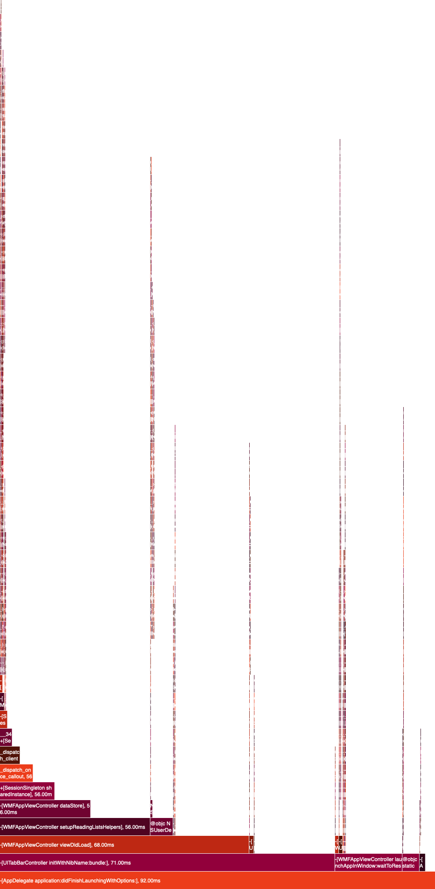

# FlameGraph

Work in Progress 

A CommandLine tool to generate FlameGraphs from Xcode Instruments traces

An example FlameGraph for the -[AppDelegate application:didFinishLaunchingWithOptions:] method of the Wikipedia iOS App:


## Usage

1. Run Time Profiler in Instruments
2. Select Thread and region you are interested in
3. Edit > Deep copy
4. Save copied content to a file 
5.
```
$ swift build
$ ./.build/debug/FlameGraph <Input path> <OutputPath.png>
```